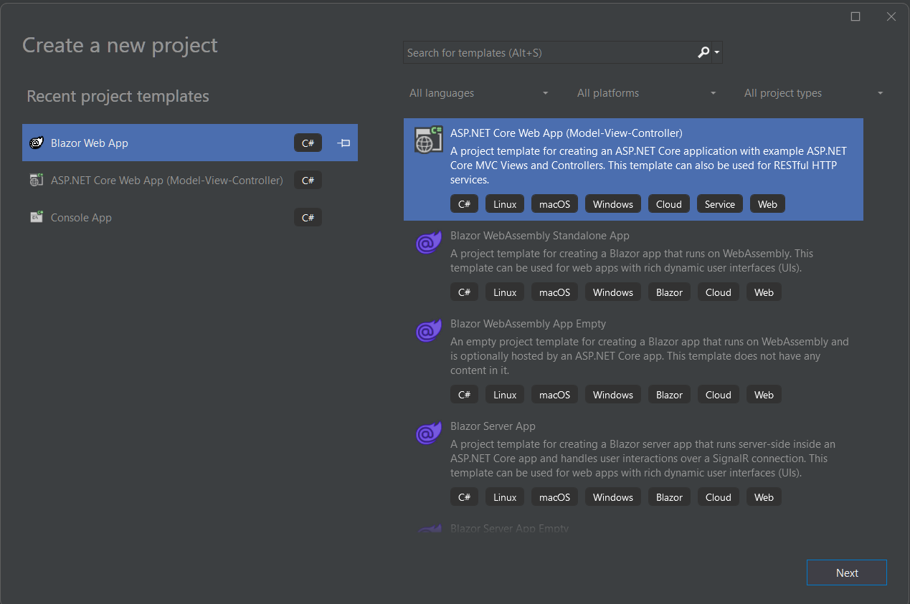
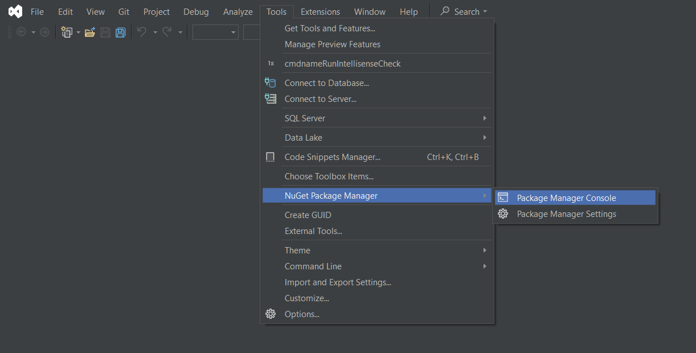
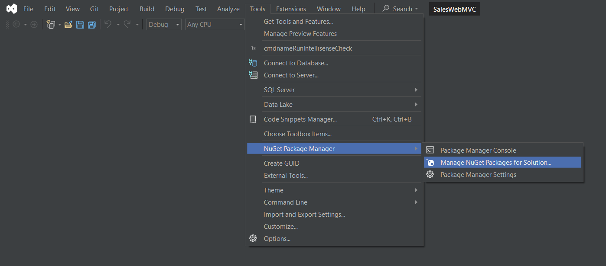
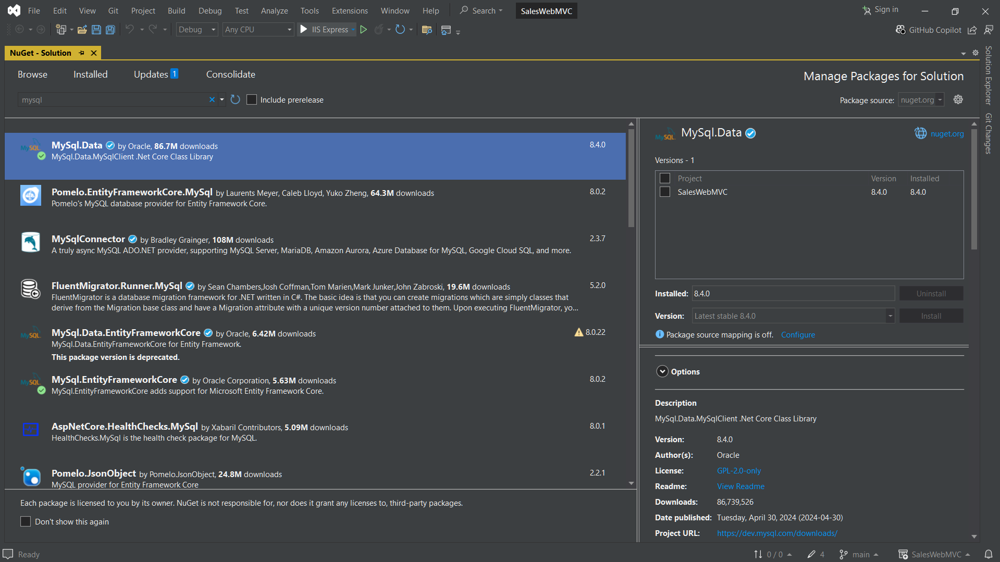

# SalesWebMVC Updated Project (.NET 8)

> Desenvolvendo um projeto [**ASP.NET MVC**](https://dotnet.microsoft.com/en-us/apps/aspnet/mvc) de uma aplicação modelo baseada no projeto [_#workshop-asp-net-core-mvc_](https://github.com/acenelio/workshop-asp-net-core-mvc) do professor [_@acenelio_](https://github.com/acenelio) a partir do curso [**"C# COMPLETO Programação Orientada a Objetos + PROJETOS"**](https://www.udemy.com/course/programacao-orientada-a-objetos-csharp/) na _Udemy_.
> O meu propósito com este projeto é atualizar a versão desenvolvida em [**.NET 2.1**](https://learn.microsoft.com/en-us/dotnet/core/whats-new/dotnet-core-2-1) para a versão mais recente do framework ([**.NET 8.0**](https://learn.microsoft.com/en-us/dotnet/core/whats-new/dotnet-8/overview))


## _Get Started_

> Pretendo com este README explicitar o que é necessário para o desenvolvimento da aplicação em uma verão mais recendo do **.NET**, não necessariamente me propondo a explicar toda a aplicação. Por esta razão, é necessário ter uma mínima noção de **MVC + ASP.NET** ou que esteja fazendo o curso do [_@acenelio_](https://github.com/acenelio).

Existem diferentes ferramentas de desenvolvimento para utilizar o **C#/.NET**, sejam IDEs (como o [_**Visual Studio 2022 Community**_](https://visualstudio.microsoft.com/pt-br/vs/community/) da _Microsoft_ ou [_**Rider**_](https://www.jetbrains.com/pt-br/rider/) da _JetBrains_) ou editores de texto (o melhor exemplo é o [_**Visual Studio Code**_](https://code.visualstudio.com/Download) com extensões razoáveis para desenvolver em **.NET** — [**C#**](https://marketplace.visualstudio.com/items?itemName=ms-dotnettools.csharp) e [**C# Dev Kit**](https://marketplace.visualstudio.com/items?itemName=ms-dotnettools.csdevkit)). No caso, utilizarei os exemplos com o _**VS 2022**_ e o _**VS Code**_, já que o no caso do **VS Code** é necessário rodar todas as instruções no _**.NET CLI**_.

> Antes de mais nada, volto a reforçar que, para o projeto eu utilizei a versão **8.0.5** (**SDK 8.0.300**) do **.NET 8**, então, verifique sua versão com o comando:
>
> ```bash
> dotnet --version
> ```
>
> ou veja se há algum **SDK** desta versão em sua máquina e utilize-a:
>
> ```bash
> dotnet --list-sdks
> ```

Para começar a aplicação, vamos inicializar um projeto com **ASP.NET MVC**.

Com _**.NET CLI**_:

```bash
dotnet new mvc -o YourMvcProject
```

Ou com o _template_ padrão **MVC** do _**Visual Studio**_ (na interface, acesse **_File_>_New_>_Project_** ou _**Ctrl+Shift+N**_):




## Concepção

Como a implementação do projeto no curso já é um tanto quanto antiga, pois a versão do **.NET 2.1** é de 2018, sendo que o patch mais recente é de 2021.
Aliás, no próprio site de [download da versão](https://dotnet.microsoft.com/en-us/download/dotnet/2.1) não recomenda o uso da versão porque esta não recebe mais suporte, ou seja, é insegura - recomendando o .NET 8.0 (que é LTS).

> **IMPORTANTE**: novamente, não irei me ater em explicar sobre o _MySQL_, _MVC_ ou _Entity Framework_, é necessário já ter noções básicas para reproduzir o projeto de modo fluído.

Agora, para podermos manipular o código sem problema, vamos instalar o pacote do _**MySQL**_ (considerando que você já tenha instaldo _**SGBD**_ em sua máquina) para nossa aplicação pelo _**Nuget**_, o [_`MySql.Data 8.4.0`_](https://www.nuget.org/packages/MySql.Data/) (que foi o pacote que eu utilizei - _fique a vontade para mudanças ou sugestões_) e o [_`MySql.EntityFrameworkCore 8.0.2`_](https://www.nuget.org/packages/MySql.EntityFrameworkCore/): <br>
Existem alguns caminhos, listarei três deles: (execute as instruções no diretório do projeto)

- Pelo _**.NET CLI**_:

```bash
dotnet add package MySql.Data --version 8.4.0
dotnet add package MySql.EntityFrameworkCore --version 8.0.2
```

- Pelo _**Package Manager**_:



```bash
PM> Install-Package MySql.Data -Version 8.4.0
PM> Install-Package MySql.EntityFrameworkCore -Version 8.0.2
```

- Pela interface do _**Visual Studio**_:





Logo, em caso de sucesso, haverá as seguintes linhas no seu `YourMvcProject.csproj`:

```cs
<ItemGroup>
    ...
    <PackageReference Include="MySql.Data" Version="8.4.0" />
    <PackageReference Include="MySql.EntityFrameworkCore" Version="8.0.2" />
</ItemGroup>
```

Desta maneira, considerando que tudo tenha ocorrido bem, basta adicionarmos as configurações em nossa aplicação. Para isso, faremos alguns passos.

### Crie a classe `Configuration.cs`

> É questão de detalhe, mas muito importante quando o projeto é grande (e existem várias conexões de diferentes bancos) e principalmente quando se utiliza informações sensíveis, como a conexão ao banco ou dados de login (existem métodos mais eficazes e seguros para fazer isso, porém essa classe já é suficiente, mas não se acanhe em trazer alguma melhoria `:)`), pois caso eu não versione essa classe, os dados ficam encapsulados.

Segue a classe:

```cs
namespace YourMvcProject
{
    public static class Configuration
    {
        public const string ConnectionString = "server=...;database=...;user=...;password=...;";
        // a connection string no MySQL segue esse padrão
    }
}
```

### Em `Data/YourMvcProjectContext.cs`

> Essa é a classe derivada de `DbContext` do **EF**, que seria uma forma de abstrair o acesso ao banco de dados, uma forma muito interessante de integrar consultas ao banco sem necessariamente escrever uma _string_ com o script **SQL** -- como é padrão no ADO.NET --, basta simplesmente utilizar o LINQ e recursos exclusivos do **EF** para isso!

Agora só é necessário sobrescrever o método `OnConfiguring()` (ou substituir, caso já exista):

```cs
...
protected override void OnConfiguring(DbContextOptionsBuilder optionsBuilder)
    => optionsBuilder.UseMySQL(Configuration.ConnectionString);
// Como só há uma linha, podemos utilizar o Expression Body
...
```

### Em `appsettings.json`

> Caso tenha utilizado _scaffolding_, será necessário editar a linha que apresentarei, pois este recurso adicionar a _Connection String_ para _**MS SQL Server**_ (só em caso de está utilizando outro banco de dados, como venho mostrando)

Basta adicionar (ou editar) a seguinte linha:

```json
//...
    "ConnectionStrings": {
        "DefaultConnection": "server=...;database=...;user=...;password=..."
    }
//...
```

### Em `Program.cs`

Por fim, só basta injetar o contexto do banco na aplicação propriamente, havendo duas maneiras para isso:

- Com a definição da _Connection String_ em `appsettings.json`:

```cs
...
builder.Services
        .AddDbContext<YourMvcProjectContext>(options =>
            options.UseMySQL(builder.Configuration.GetConnectionString("DefaultConnection") ??
            throw new InvalidOperationException("Connection string 'DefaultConnection' not found."),
            opt => opt.MigrationsAssembly("YourMvcProject"))
        );
...
```

- Ou com `Configuration.ConnectionString`:

```cs
...
builder.Services
        .AddDbContext<YourMvcProjectContext>(options =>
            options.UseMySQL(Configuration.ConnectionString ??
            throw new InvalidOperationException("Connection string not found."),
            opt => opt.MigrationsAssembly("YourMvcProject"))
        );
...
```

Compile a aplicação e corrija os potenciais erros que possa aparecer (qualquer dúvida, entre em contato), então continue o desenvolvimento da aplicação do projeto.

### _Migrations_

Só um acréscimo quanto a criação de migrações e atualização do contexto do banco de dados:
como no curso se utiliza o terminal do gerenciado de pacotes no _**Visual Studio**_, não serão os mesmos comandos no terminal padrão para quem utilizar o _**Visual Studio Code**_.

Então, será necessário adicionar uma ferramenta adicional, o `dotnet ef`; com este comando, podemos gerenciar o **EF** pelo _CLI_.

Começaremos instalando essa ferramenta:

```bash
dotnet tool install --global dotnet-ef
dotnet ef
```

O último comando apresenta a interface padrão do _CLI_ como verificação da instalação.

Feito isso, basta seguir tais comandos:

**Criação de _Migrations_**

```bash
dotnet ef migrations add Initial
```

que equivale a:

```bash
Add-Migration Initial
```

**Atualização do Banco de Dados**

```bash
dotnet ef database update Initial
```

que equivale a:

```bash
Update-Database Initial
```

## Detalhes de implementação

O último ponto que tenho a dizer, é sobre as configurações de injenção de dependência e entre outras configurações adicionais no **ASP.NET**, que desde o **.NET 6** ocorre na classe `Program.cs` não havendo mais a necessidade de uma classe intermediária de configurações -- pelo menos, em caso não tão complexos/extensos --, a classe `Startup.cs`.

> Seria interessante ter classes à parte para injetar muitas configurações e dependências (ou utilizando _extension methods_) para justamente evitar que a classe `Program.cs` se torne muito carregada.
>
> Isto é, reinserir a classe `Startup.cs`. Mas quando de fato se ver como necessário fazer isso.

### Os serviços e o `SeedingService.cs`

Os quatro serviços criados durante o projeto (assim como o serviço que eu criei, o `GitHubService.cs`), não diferem tanto do que foi mostrado pelo Nélio, mas é necessário ter atenção aonde adicionar as referências aos serviços na classe `Program.cs`. Como estamos falando de injetá-los na aplicação, precisamos **adicioná-los** ao contexto logo após criar o `builder`:

```cs
var builder = WebApplication.CreateBuilder(args);

// other services...

// Add data service for seeding
builder.Services.AddScoped<SeedingService>();

// Add seller service to the scope
builder.Services.AddScoped<SellerService>();

// Add department service to the scope
builder.Services.AddScoped<DepartmentService>();

// Add sales record service to the scope
builder.Services.AddScoped<SalesRecordService>();

// Add GitHub profile service to the scope
builder.Services.AddScoped<GitHubService>();

var app = builder.Build();
```

Já no caso da classe `SeddingService.cs`, a sua configuração é um tanto diferente do que fora mostrado pelo Nélio -- exceto pela sua injeção, que é da mesma maneira dos outros serviços, como é mostrado anteriormente --, sendo necessário criar um escopo para aí sim chamar o método `.Seed()`:

```cs
using (var serviceScope = app.Services.CreateScope())
{
    var services = serviceScope.ServiceProvider;
    var seedingService = services.GetRequiredService<SeedingService>();
    seedingService.Seed();
}
```

> Foi um tanto complicado achar uma solução para este último, então recomendo olhar a documentação do [_**ASP.NET** sobre injeção de dependências_](https://learn.microsoft.com/pt-br/aspnet/core/fundamentals/dependency-injection?view=aspnetcore-8.0#resolve-a-service-at-app-start-up).

Caso seja mais interessante ao seu caso, pode adicionar uma classe `Startup.cs` -- na verdade, o nome que lhe for adequado --, como anteriormente dito, e adicionar o código necessário para segregar as configurações de serviços e tudo mais da classe `Program.cs`.
